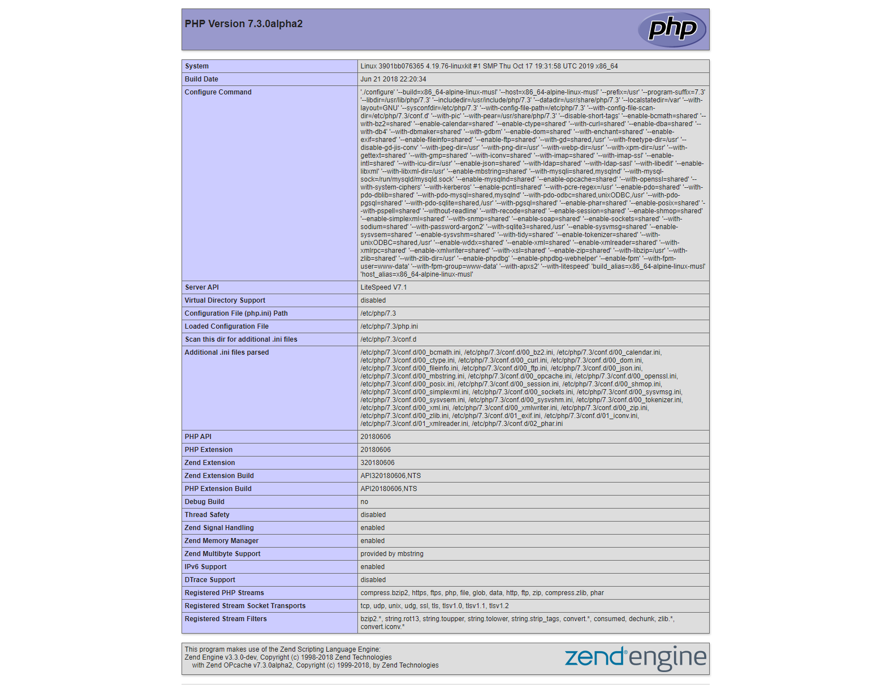

PHPEarth OpenLiteSpeed Examples
===============================

For any other tags within the `phpearth/php` docker tags, it is clear where to 
put your code (`/var/www/html`) but it doesn't appear working with litespeed.

The problem fundamentally that the litespeed tag is not configured, assumes 
that you will configure it yourself. That is not a huge problem and this repo
will try to aid through a simple setup so you could use it!

I've prepared a few examples on how to configure your litespeed server quickly.
Please note, that these examples not optimal, nor production-ready.

The purpose of them is to help you to take your first steps!

You can clone the examples from GitHub:
```bash
git clone https://github.com/adaliszk/phpearth-litespeed-examples.git
```

All of the examples contain a docker-compose and all you need to do forsee
the results are to `docker-compose up` in the example folder of your choosing.


Examples
--------

- **OVERWRITE-ZIP**:  
  This is the most simple setup, use it to check out your code with a really
  simple config.

- **VHOST-CONFIG**:  
  When you wish to configure your server use this to sync the config with your
  VCS. The Dockerfile there shows an example of how to create your base image.

- **DEFAULT**:  
  This is the original behavior of the tag, bellow you can find a step-by-step
  guide how to set up your environment. Please note that you will need to save
  out your `httpd_config.conf` and vhost configuration from `/etc/litespeed` to
  build your image later!


How to set up your virtual host?
================================

By default, the `phpearth/php` gives you the after-installation state of the 
litespeed server. This server exposes two ports:

- `8088`: Default vhost, usually an Example page with links to documentation.
  I've redirected this port to a widely used `8080` using docker-compose.

- `7080`: Administration panel, I've redirected this port to `8000` using
  docker-compose.


Getting started
---------------

As a first step, let us navigate into the default example, and spin up the 
docker environment:
```bash
cd ./default && docker-compose up
```

On your http://localhost:8080 should be a nice welcome page, which contains
useful links to the OpenLiteSpeed documentation!


Your http://localhost:8000 should contain the administration panel, where you 
can log in using the default `admin` with a password `123456`.


After successfully logging in you should see the dashboard.


On this overview you can already dee that there is a `Default` listener on
`8088`, and there is one virtual host in use:


Setting up the virtual host
---------------------------

To set up a virtual host we are going to need two things. A listener, and 
a virtual host configuration. Lucky for us, we already have a prebuilt 
listener, so that one is done. So the next step is creating a virtual host:


We can delete the existing Example, or just leaving it be, that is your call.
When you click to "Add" a virtual host you'll get a nice form to configure
everything:


In essentials, you will need to configure:

- `Virtual Host Name`: Just a name that you as an admin would recognize.  
  Try to keep it free from special characters and white-space.

- `Virtual Host Root`: 
  This is your document root, where your files live.

- `Config File`:
  This is where your configuration lives. By default, it is recommended to use
  `$SERVER_ROOT/conf/vhosts/$VH_NAME/vhconf.conf` which will put it under the
  `/etc/litespeed/vhosts`.
  
  The `$SERVER_ROOT` is `/var/lib/litespeed`, where the `conf` is symlinked to
  the `/etc/litespeed/`.
  
  By design, all configurations must be under `$SERVER_ROOT/conf`!

- `Enable Scripts/ExtApps`: 
  This will allow you to use CGI scripts

- `Restrained`:
  This will limit your vhost to reach locations which are not under your Root

> NOTE: When you save the configuration you will be warned that the vhost
>       configuration does not exist, just click CREATE fo bypass that!


After you saved, quickly open edit again and set the `Document Root` on the
`General` tab:


Setting up Script Handlers
--------------------------

On each virtual host you can configure which kind of scripts you wish to run,
when the page is accessed. 


Here we will need to configure that our vhost should execute `php` extenions
with one of the available script runner modules:


Setting up the Listener
-----------------------

On the listeners' page, you can configure HTTP/HTTPS pools which could serve 
many virtual hosts with a set of modules.


Here we are going to change the `Default` listener, and add our new vhost:


We can see here that the Example Virtual Host is being used for all domains.
To change that we can edit this entry, and just swap it with our previously
created virtual host:


When you are done, restart the server gracefully, by clicking the green refresh
button on the top-right section of the administration page.


Accessing the Virtual Host
--------------------------

After the graceful restart was done, you should able to visit your 
http://localhost:8080 and see the included index.php running:


